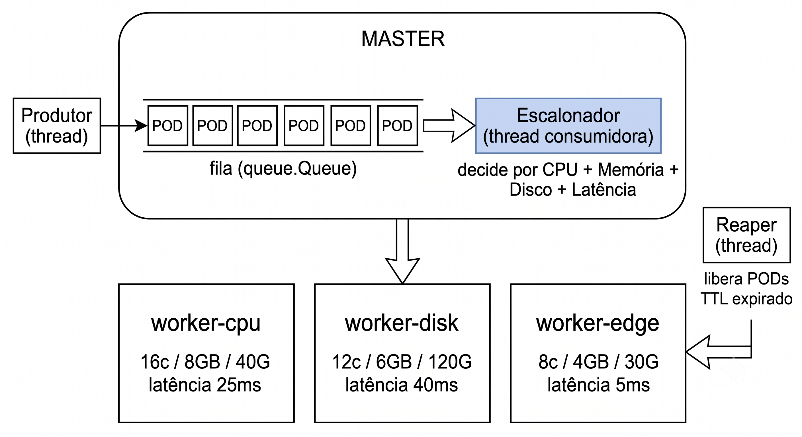

# OrquestraPOD — Orquestrador de PODs com escalonamento multi-métrica

Trabalho I — **Laboratório de Sistemas Operacionais** (Unisinos, 2026/1).
Integrante: Eduardo Rodrigues Graf

Vídeo de apresentação: [assistir no Google Drive](https://drive.google.com/file/d/1a8Ku3ZxgdmmP1UzLi9-sFJk5-NV9iOUX/view?usp=drive_link) (ou o arquivo local [`OrquestraPOD.mp4`](OrquestraPOD.mp4))

Simulação, em Python, de um orquestrador de PODs no estilo **Kubernetes**: um nó **Master**
com escalonador, **três nós Workers** heterogêneos e uma carga de **mais de uma dezena de PODs**.
O diferencial é o **escalonador multi-métrica**, que decide a alocação usando **4 métricas**
(CPU, memória, **disco** e **latência de rede**). Duas a mais que o escalonador padrão do
Kubernetes, que considera apenas CPU e memória.

A solução demonstra conceitos de SO: **threads** e o paradigma **produtor/consumidor**, e
apresenta tudo em um **dashboard web em tempo real**.

---

## Arquitetura




**Threads (concorrência):**
- **Produtor** — cria PODs com perfis variados e os coloca na fila (`queue.Queue`).
- **Consumidor / Escalonador** — retira PODs da fila e os aloca no melhor Worker.
- **Reaper** — finaliza PODs cujo tempo de vida (TTL) expirou, liberando recursos.

O estado compartilhado do cluster é protegido por um `threading.Lock` (exclusão mútua).

### Algoritmo de escalonamento (proposto)
Para cada POD, filtra os Workers que **comportam** os requisitos (CPU, memória e disco livres
suficientes) e escolhe o de **maior pontuação**:

```
score = 0.30·folga_cpu + 0.30·folga_mem + 0.25·folga_disco
      + 0.15·(1 − latência/latência_max)·sensibilidade_latência_do_pod
```

- As "folgas" favorecem o nó que ficará mais livre após a alocação → **balanceamento de carga**.
- O termo de latência favorece nós rápidos **apenas** para PODs sensíveis à rede (web, cache).

---

## Estrutura do projeto

```
app.py                       Servidor Flask (rotas + inicialização do cluster)
cluster/
  __init__.py                Marca o pacote cluster
  pod.py                     PODs e perfis de aplicação (web/api/cache/batch/db)
  worker.py                  Nós Workers (capacidades, encaixe, alocação, utilização)
  scheduler.py               MultiMetricScheduler (proposto) e DefaultScheduler (padrão)
  master.py                  Master: threads produtor/consumidor/reaper + fila + lock
  stats.py                   Estatísticas e comparação entre os dois escalonadores
templates/index.html         Dashboard
static/style.css             Estilo
static/app.js                Polling + render + gráficos (Chart.js)
static/cluster.svg           Diagrama animado do cluster (Master + Workers)
static/vendor/
  chart.umd.min.js           Chart.js vendorizado (gráficos sem CDN)
test_scheduler.py            Testes unitários do escalonamento
requirements.txt             Dependências (Flask)
```

---

## Como executar

Requer **Python 3.10+**.

```bash
pip install -r requirements.txt
python app.py
```

Abra **http://127.0.0.1:5000** no navegador.

No dashboard você verá:
- a **fila** enchendo (produtor) e esvaziando (consumidor);
- os **Workers** recebendo PODs, com barras de **CPU / Memória / Disco** e a **latência**;
- PODs **sumindo** quando o TTL expira (reaper liberando recursos);
- **estatísticas** (gráficos de utilização e de PODs por Worker);
- o botão **“Comparar proposto × padrão”**, que roda a mesma carga nos dois escalonadores.

### Testes
```bash
python -m pytest -v      # ou:  python test_scheduler.py
```